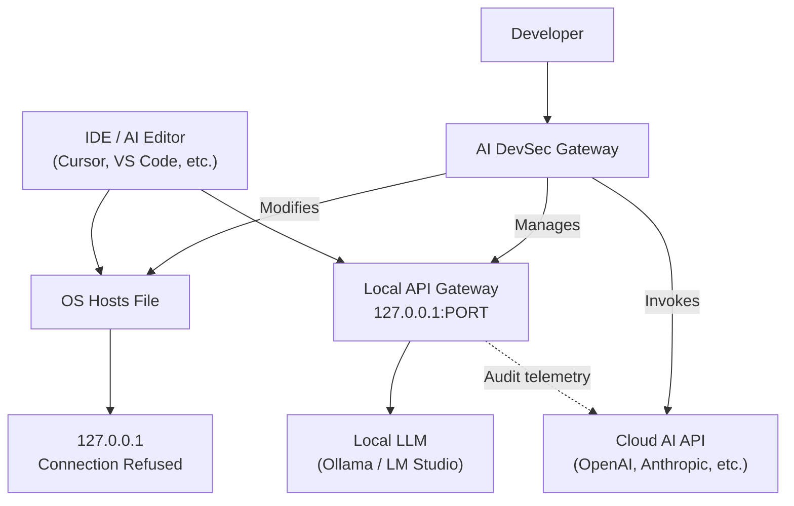
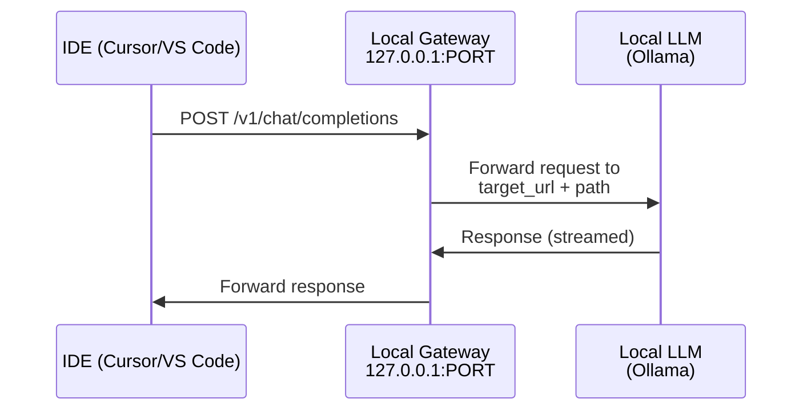
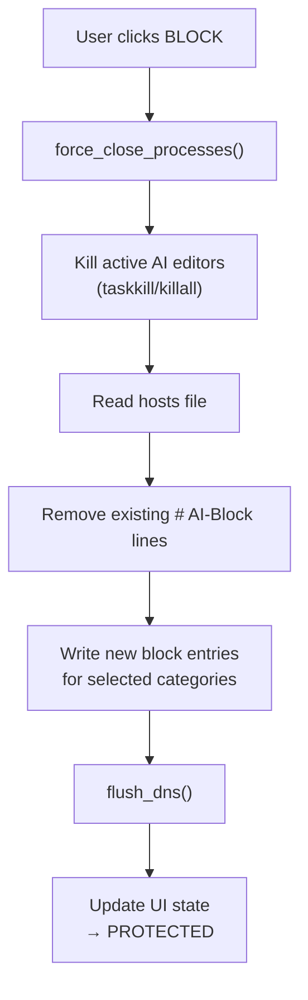

# 🏗️ Architecture — AI DevSec Gateway

This document describes the high-level architecture, key design decisions, and internal data flow of AI DevSec Gateway. It is intended for contributors, security auditors, and anyone evaluating the project for use in their environment.

---

## Overview

AI DevSec Gateway is a **single-binary, zero-dependency desktop application** that operates at the OS level to intercept, audit, and route AI-related network traffic. It combines three core engines into one unified GUI:

```
┌─────────────────────────────────────────────────────┐
│                  AI DevSec Gateway                  │
│                                                     │
│  ┌──────────────┐  ┌──────────┐  ┌──────────────┐  │
│  │ Hosts Engine │  │ API      │  │ DevSec       │  │
│  │ (DNS Override│  │ Gateway  │  │ Auditor      │  │
│  │  & Kill      │  │ (Proxy)  │  │ (LLM-powered)│  │
│  │  Switch)     │  │          │  │              │  │
│  └──────────────┘  └──────────┘  └──────────────┘  │
│                                                     │
│  ┌──────────────────────────────────────────────┐   │
│  │           Tkinter GUI (Catppuccin Mocha)      │   │
│  └──────────────────────────────────────────────┘   │
└─────────────────────────────────────────────────────┘
```

---

## System Context (C4 Level 1)



---

## Core Components

### 1. Hosts Engine (DNS Override & Kill Switch)

**Purpose:** Deterministic, OS-level blocking of AI domains by routing them to `127.0.0.1` in the system hosts file.

**How it works:**
1. Reads the system hosts file (`C:\Windows\System32\drivers\etc\hosts` on Windows, `/etc/hosts` on Unix)
2. Adds entries like `127.0.0.1 api.openai.com # AI-Block` for each blocked domain
3. Flushes the OS DNS cache to ensure changes take effect immediately
4. Uses the `# AI-Block` comment tag as a marker — **never modifies lines without this tag**

**Key functions:**
- `activate_block(lang, categories)` — Writes block entries and closes AI editor processes
- `deactivate_block(lang)` — Removes all `# AI-Block` lines from hosts file
- `get_hosts_status()` — Single-pass read to determine current blocking state
- `flush_dns()` — Cross-platform DNS cache flush (ipconfig / dscacheutil / systemd-resolve)

**Security invariant:** The engine only touches lines containing `# AI-Block`. All other hosts file entries are preserved verbatim.

### 2. Local API Gateway (Transparent Proxy)

**Purpose:** Intercept HTTP requests from IDEs and transparently proxy them to local LLMs (Ollama, LM Studio) or custom endpoints.

**Architecture:**


**Implementation:** Uses Python's `http.server.ThreadingHTTPServer` with a custom `BaseHTTPRequestHandler` to proxy GET, POST, and OPTIONS requests.

**Key design decisions:**
- **No TLS termination** — The gateway operates on plain HTTP at `127.0.0.1` (loopback only). TLS interception is planned for Phase 2.
- **No external dependencies** — Uses `urllib.request` from the stdlib instead of `requests` or `httpx`.
- **Streaming support** — Reads and forwards response data in 1KB chunks for SSE compatibility.

### 3. DevSec Auditor (LLM-Powered Security Analysis)

**Purpose:** Live analysis of running processes to detect data leak risks, powered by cloud LLM APIs.

**Security model:**
- API keys are **never persisted to disk** — stored only in memory during the session
- Keys can be provided via the `OPENAI_API_KEY` environment variable or entered in the UI
- The `SENSITIVE_CONFIG_KEYS` set ensures keys are stripped before any config save operation

### 4. GUI Layer (Tkinter + Catppuccin Mocha)

**Purpose:** Premium dark-mode desktop interface with tab-based navigation.

**Structure:**
- **Tab 1 — AI Blocker:** Main kill switch, category toggles, profile selector, activity log
- **Tab 2 — DevSec Gateway:** Proxy configuration, auditor interface, API key management
- **System Tray:** Windows system tray integration with state-colored icons and context menu

**Key UI patterns:**
- Toast notifications (non-blocking) instead of modal dialogs
- Smooth color fade transitions between PROTECTED and EXPOSED states
- Real-time process polling (3-second interval) for AI editor detection
- Keyboard shortcuts: `Ctrl+B` (toggle), `Ctrl+Q` (quit), `Ctrl+L` (log panel)

---

## Data Flow

### Blocking Flow



### Configuration Persistence

```
config.json (in %APPDATA%/AI-Blocker/ or ~/.config/AI-Blocker/)
├── language: "es"              # Selected UI language
├── profile: "work"             # Active blocking profile
├── checked_categories: {...}   # Per-category toggle state
├── custom_domains: {...}       # User-added domains
├── logs: [...]                 # Activity log entries
├── last_toggle_time: "..."     # Timestamp of last toggle
└── autostart: true/false       # Windows autostart preference
    ⚠ API keys are NEVER saved here (SENSITIVE_CONFIG_KEYS)
```

---

## Platform Support

| Capability | Windows | Linux | macOS |
|---|---|---|---|
| Hosts file editing | ✅ `%SystemRoot%\System32\drivers\etc\hosts` | ✅ `/etc/hosts` | ✅ `/etc/hosts` |
| DNS cache flush | ✅ `ipconfig /flushdns` | ✅ `systemd-resolve` / `resolvectl` | ✅ `dscacheutil` + `mDNSResponder` |
| Process detection | ✅ `tasklist` | ✅ `ps -A -o comm=` | ✅ `ps -A -o comm=` |
| Process termination | ✅ `taskkill /F` | ✅ `killall` | ✅ `killall` |
| UAC/sudo elevation | ✅ Auto-UAC via `ShellExecuteW` | ⚠ Manual `sudo` | ⚠ Manual `sudo` |
| System tray | ✅ Native Win32 | ❌ Not implemented | ❌ Not implemented |
| Autostart | ✅ Registry `Run` key | ❌ Not implemented | ❌ Not implemented |

---

## Security Considerations

### Threat Model

| Threat | Mitigation |
|---|---|
| API key leakage to disk | `SENSITIVE_CONFIG_KEYS` set strips keys before `save_config()` |
| Hosts file corruption | Only modifies lines with `# AI-Block` marker; atomic read-clean-write cycle |
| Privilege escalation | Runs with admin/root only for hosts file access; no network listeners on external interfaces |
| Supply chain attack | Zero third-party runtime dependencies; Python stdlib only |
| MITM on gateway proxy | Gateway binds to `127.0.0.1` only (loopback); not accessible from network |

### Privilege Model

The application requires elevated privileges (`Administrator` on Windows, `root` on Linux/macOS) **solely** to modify the system hosts file. All other functionality (UI, process detection, gateway proxy) works without elevation.

---

## Technology Stack

| Layer | Technology | Rationale |
|---|---|---|
| Language | Python 3.10+ | Cross-platform, no compilation needed, stdlib-rich |
| GUI | Tkinter (stdlib) | Zero dependencies, ships with Python |
| HTTP Server | `http.server.ThreadingHTTPServer` | Stdlib, threaded, sufficient for local proxy |
| HTTP Client | `urllib.request` | Stdlib, avoids adding `requests` dependency |
| Process Mgmt | `subprocess` | Stdlib, cross-platform process interaction |
| Config Storage | JSON files | Simple, human-readable, no database needed |
| Build Tool | PyInstaller | Single-binary output, cross-platform support |
| CI/CD | GitHub Actions | Multi-OS matrix, CodeQL scanning, automated releases |
| Linter | Ruff | Fast, comprehensive Python linter |
| Tests | pytest + pytest-cov | Industry standard, coverage reporting |

---

## Design Decisions Log

| Decision | Rationale | Alternatives Considered |
|---|---|---|
| **Single-file architecture** | Maximizes portability and simplifies PyInstaller builds | Multi-module package (planned for v2.0) |
| **Zero external dependencies** | Minimizes supply chain attack surface for a security tool | `requests`, `click`, `rich` |
| **Hosts file over firewall rules** | Deterministic, works without special drivers, easy to audit | Windows Firewall API, iptables, network extensions |
| **Tkinter over Electron/Qt** | Ships with Python stdlib, ~15KB source vs. ~100MB Electron | PyQt5, Dear ImGui, web UI |
| **Catppuccin Mocha theme** | Popular, accessible dark palette with strong community | Dracula, Nord, custom palette |
| **Bilingual comments (EN/ES)** | Project originated in the Spanish-speaking community | English-only |

---

## Future Architecture (v2.0+)

The planned evolution includes:

1. **Modular package structure** — Break `ai_blocker.py` into focused modules
2. **TLS interception** — Local root CA for HTTPS deep packet inspection
3. **Headless daemon mode** — Run as Windows Service / systemd unit
4. **Plugin system** — Extensible auditor providers and blocking strategies
5. **WebSocket dashboard** — Real-time token usage and traffic analytics

See [ROADMAP.md](ROADMAP.md) for the complete development timeline.
