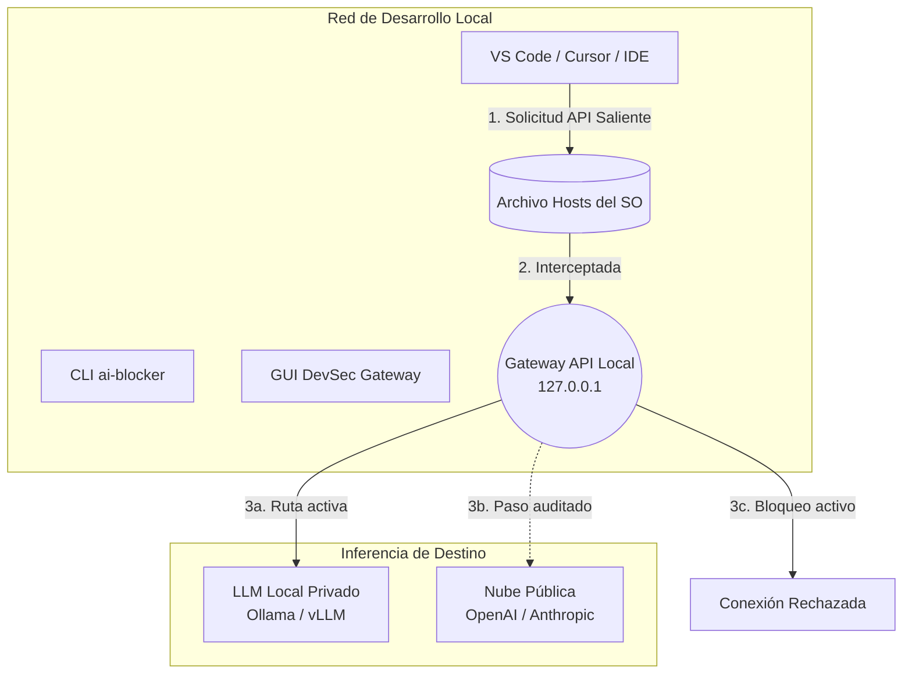

# 🛡️ AI DevSec Gateway (antes AI Network Blocker)

> **Interceptor, auditor y enrutador Zero-Trust para todo tu tráfico de IA.**

<p align="center">
  
</p>

[](https://www.python.org/)
[](#-inicio-rápido)
[](https://github.com/Akunimal/AI-Router-Blocker-AiO/actions/workflows/test.yml)
[](https://github.com/Akunimal/AI-Router-Blocker-AiO/actions/workflows/codeql.yml)
[](https://codecov.io/gh/Akunimal/AI-Router-Blocker-AiO)
[](https://pypi.org/project/ai-devsec-gateway/)
[](LICENSE)

[English](README.md) | [Español](README.es.md)

---

## 📖 ¿Qué es esto?

**AI DevSec Gateway** es un proxy y herramienta DevSecOps de código abierto y nivel empresarial que intercepta, audita y enruta el tráfico de IA que sale de tu máquina local.

Creado originalmente como una simple interfaz gráfica para bloquear dominios de IA, ha evolucionado hasta convertirse en un **Gateway Zero-Trust** completo. Permite a los desarrolladores y equipos de seguridad monitorear exactamente qué datos están exfiltrando sus asistentes de código de IA (como Copilot, Cursor o extensiones), interceptar esas solicitudes y enrutarlas a LLMs privados, locales o corporativos.

1. **Interceptar y Bloquear:** Una anulación determinista a nivel del sistema operativo mediante el archivo `hosts` que descarta conexiones salientes no autorizadas a más de 38 dominios de IA.
2. **Enrutar:** Un proxy HTTP local transparente que intercepta las solicitudes a APIs en la nube y las redirige a LLMs locales (como Ollama, LM Studio o vLLM).
3. **Auditar:** Análisis semántico en tiempo real de los entornos de desarrollo activos para prevenir la fuga de datos y la exposición de lógica propietaria.

---

## ✨ Características

| Función | Descripción |
|---|---|
| 🔀 **Enrutador API Transparente** | Redirige sin problemas el tráfico HTTP de Copilot/Cursor a tus propios servidores locales de inferencia LLM. |
| 🛡️ **Auditor AI DevSec** | Análisis en vivo y a nivel de socket de los procesos en ejecución para detectar fugas de telemetría. Impulsado por auditorías de OpenAI bajo demanda (Zero-Persistence). |
| 💻 **Interfaz CLI Nativa** | Control completo desde la terminal para entornos CI/CD. Usa `ai-blocker --status` o `ai-devsec-gateway --block`. |
| 🔒 **Interruptor de Apagado Determinista** | Bloqueo a nivel de sistema operativo (redirección a `127.0.0.1`). Sin ambigüedades ni dependencia de servidores de filtrado DNS. |
| 📦 **Distribución Universal** | Instalable vía `pip`, `brew`, `scoop`, o como un único binario ejecutable portable para Windows/Linux/macOS. |
| 🌍 **Interfaz Multilingüe** | Una interfaz gráfica premium (Catppuccin Mocha) con 10 idiomas soportados y elevación inteligente de privilegios del SO (UAC/sudo). |

---

## 🎯 Proveedores Soportados

El motor de intercepción por defecto apunta a **más de 38 dominios** de los principales proveedores:

| Proveedor | Dominios clave interceptados |
|---|---|
| 🟢 **OpenAI** | `api.openai.com`, `chatgpt.com`, `platform.openai.com` |
| 🟠 **Anthropic** | `claude.ai`, `api.anthropic.com`, `anthropic.com` |
| 🐙 **GitHub Copilot** | `copilot.github.com`, `api.githubcopilot.com`, `telemetry.githubcopilot.com` |
| 🔵 **Google AI** | `gemini.google.com`, `aistudio.google.com` |
| 🟦 **Microsoft** | `copilot.microsoft.com`, `bing.com` |
| 🔷 **Meta AI** | `meta.ai`, `ai.meta.com` |
| 🌊 **Mistral / DeepSeek / xAI** | `mistral.ai`, `api.deepseek.com`, `api.x.ai` |

> *La lista de bloqueo es configurable dinámicamente desde [`ai_blocker/constants.py`](ai_blocker/constants.py).*

---

## 🏗️ Arquitectura

AI DevSec Gateway opera en la frontera entre tu entorno de desarrollo local y la nube.



Para sumergirte en profundidad en nuestra estructura modular, los planes de Inspección Profunda de Paquetes (DPI) y los Modelos de Amenazas, lee nuestra **[Documentación de Arquitectura](docs/architecture.md)**.

---

## 🚀 Inicio Rápido

### 1. Paquete de Python (Pip)
La forma más rápida de empezar a usar la interfaz CLI (terminal).

```bash
pip install ai-devsec-gateway

# Los comandos CLI nativos estarán disponibles globalmente:
ai-blocker --status
ai-devsec-gateway --block
ai-devsec-gateway --unblock
```

### 2. Gestores de Paquetes (macOS y Windows)

**macOS (Homebrew):**
```bash
brew tap Akunimal/ai-devsec-gateway https://github.com/Akunimal/AI-Router-Blocker-AiO
brew install ai-devsec-gateway
sudo ai-blocker --status
```

**Windows (Scoop):**
```powershell
scoop bucket add ai-devsec-gateway https://github.com/Akunimal/AI-Router-Blocker-AiO.git
scoop install ai-devsec-gateway
ai-blocker --status
```

### 3. Binarios GUI Portables
Si prefieres una interfaz gráfica enriquecida sin tener que instalar Python:
1. Visita la página de [**Releases**](https://github.com/Akunimal/AI-Router-Blocker-AiO/releases).
2. Descarga el ejecutable correspondiente a tu sistema operativo (`.exe`, binario macOS o Linux AppImage).
3. Ejecuta la aplicación (automáticamente pedirá privilegios de Administrador/sudo al intentar encender el interruptor de red).

---

## 🔒 Modelo de Seguridad

- **Zero-Persistence BYOK:** Las claves de API del auditor semántico se mantienen estrictamente en la memoria RAM. Nunca se guardan en el disco duro, previniendo el robo de credenciales en la cadena de suministro.
- **Modificaciones Quirúrgicas del SO:** El motor utiliza análisis tipo `sed` para inyectar los marcadores `# AI-Block` en el archivo hosts. Garantiza aislamiento total respecto al resto de tus reglas de DNS existentes.
- **Telemetría Aislada:** La aplicación en sí misma tiene absolutamente cero rastreo, análisis de uso o mecanismos ocultos de conexión en segundo plano (phone-home).

---

## 🤝 Código Abierto y Gobernanza

Creemos firmemente que las herramientas de seguridad deben ser 100% transparentes. Este proyecto está construido bajo una gobernanza estricta de código abierto:
- **[Guía de Arquitectura](docs/architecture.md):** Especificaciones técnicas completas.
- **[Guía de Contribución](CONTRIBUTING.md):** Estándares y plantillas de PR.
- **[Código de Conducta](CODE_OF_CONDUCT.md):** Fomentamos una comunidad acogedora.
- **[Política de Seguridad](SECURITY.md):** Reporte responsable de vulnerabilidades.
- **[Licencia](LICENSE):** Licencia MIT.

---

## 🗺️ Roadmap y Visión Futura

Estamos evolucionando activamente hacia ser un **Motor DLP Zero-Trust** corporativo. Nuestros próximos hitos incluyen:
- **Sanitización DLP en Tiempo Real:** Expresiones regulares heurísticas al vuelo para eliminar PII (Información Personal Identificable) antes de enrutar el código.
- **Telemetría de Kernel eBPF:** Detectar fuga de archivos como `.git/config` directamente a nivel del núcleo de Linux.
- **Confidential Computing:** Ejecutar el Gateway de forma blindada dentro de Entornos de Ejecución Confiables (TEEs) como Intel SGX.

Explora nuestro [**ROADMAP.md**](ROADMAP.md) para conocer la visión completa.

---

<p align="center">
  <strong>Audita lo invisible. Enruta lo restringido. No confíes en ningún paquete.</strong><br>
  <em>El Gateway DevSecOps para la era de la IA.</em>
</p>
