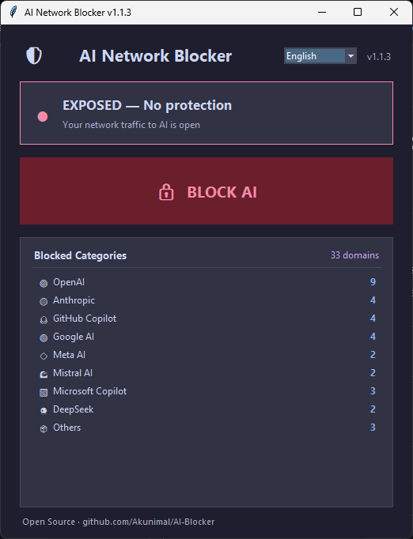

# 🛡️ AI DevSec Gateway (antes AI Network Blocker)

> **Retoma el control. Intercepta, audita y enruta el tráfico de IA en tu máquina.**

<p align="center">
  
</p>


[English](README.md) | [Español](README.es.md)

---

## 📖 ¿Qué es esto?

**AI DevSec Gateway** es una herramienta de escritorio gratuita y de código abierto que te devuelve el control sobre las herramientas de IA que se ejecutan en tu máquina. Originalmente un simple bloqueador de red, ahora ha evolucionado a un proxy DevSecOps completo.

Te ayuda a **bloquear fugas de datos no autorizadas**, **auditar tu entorno de ejecución utilizando la API de OpenAI** y **enrutar de forma transparente las peticiones a la nube hacia tus propios modelos locales de IA** (como Llama 3 vía Ollama) o tus claves API personales (BYOK).

Con un clic:
1. **Bloquea y Redirige** más de 35 dominios de IA a `127.0.0.1` editando tu archivo hosts.
2. **Enruta** tráfico local mediante un API Gateway transparente hacia tu LLM Local.
3. **Audita** los procesos activos de tus editores y genera recomendaciones de seguridad a través de la API de OpenAI.

---

## 🤔 ¿Por qué existe esto?

Los asistentes de programación de IA tienen acceso profundo y sin restricciones a tus archivos, tu portapapeles y tu terminal. Incluso cuando dejas de usarlos, sus procesos siguen ejecutándose en segundo plano, manteniendo conexiones abiertas con servidores remotos de forma silenciosa. Eso significa:

- El código que escribiste *hace horas* podría seguir transmitiéndose.
- Los prompts que contienen lógica propietaria podrían almacenarse en caché o registrarse en servidores de terceros.
- No tienes **ninguna visibilidad** sobre qué datos se envían, o cuándo.

**AI Network Blocker te da un interruptor de apagado duro y determinista.** Sin ambigüedades. Sin necesidad de confiar. El archivo hosts es una anulación a nivel de sistema: si un dominio se resuelve en `127.0.0.1`, nada pasa. Punto.

---

## ✨ Características (Features)

| Característica | Descripción |
|---|---|
| 🔀 **Router de IA Local** | Intercepta el tráfico de Copilot/Cursor y lo envía a tu propio LLM local (Ollama/LM Studio). |
| 🛡️ **Auditor DevSec de IA** | Análisis en vivo de procesos en ejecución para detectar riesgos de fuga de datos, impulsado por OpenAI. |
| 🔒 **Interruptor de apagado** | Bloquea o desbloquea todos los servicios de IA al instante vía el archivo `hosts`. |
| 🌍 **Soporte multilingüe** | 10 idiomas soportados con detección automática del sistema. |
| 🎨 **Interfaz oscura premium** | Tema moderno Catppuccin Mocha con estados codificados por colores y pestañas. |
| 🔑 **Elevación inteligente** | UAC automático en Windows, instrucciones claras de `sudo` en Unix. |
| 👁️ **Detección de procesos** | El pie de página muestra continuamente qué editores de IA se están ejecutando. |
| 📦 **Portable** | Ejecutables de un solo archivo sin dependencias pesadas. |

---

## 🎯 Proveedores y Dominios Bloqueados

La lista de bloqueo por defecto apunta a **más de 35 dominios** en 9 categorías:

| Proveedor | # Dominios | Dominios clave |
|---|---|---|
| 🟢 OpenAI | 9 | `api.openai.com` · `chatgpt.com` · `platform.openai.com` |
| 🟠 Anthropic | 4 | `claude.ai` · `api.anthropic.com` · `anthropic.com` |
| 🐙 GitHub Copilot | 4 | `copilot.github.com` · `api.githubcopilot.com` |
| 🔵 Google AI | 4 | `gemini.google.com` · `aistudio.google.com` |
| 🟦 Microsoft Copilot | 3 | `copilot.microsoft.com` · `bing.com` |
| 🔷 Meta AI | 2 | `meta.ai` · `ai.meta.com` |
| 🌊 Mistral AI | 2 | `mistral.ai` · `api.mistral.ai` |
| 🔮 DeepSeek | 2 | `deepseek.com` · `api.deepseek.com` |
| 📦 Otros | 3 | `perplexity.ai` · `app.wordware.ai` |

---

## 🚀 Inicio Rápido

### Opción A — Descargar el ejecutable listo para usar

1. Ve a la página de [**Releases**](https://github.com/Akunimal/AI-Router-Blocker-AiO/releases).
2. Descarga el binario para tu sistema operativo.
3. Ejecuta el archivo.
   - **Windows**: Haz doble clic en `AI-Router-Blocker-AiO.exe`. Haz clic en **Sí** en el aviso de UAC.
   - **Linux / macOS**: Abre una terminal y ejecuta `sudo ./AI-Router-Blocker-AiO`.
4. Haz clic en el botón grande para activar o desactivar el bloqueo. Eso es todo.

### Opción B — Ejecutar desde el código fuente

```bash
# 1. Clonar el repositorio
git clone https://github.com/Akunimal/AI-Router-Blocker-AiO.git
cd AI-Router-Blocker-AiO

# 2. Ejecutar el script (Requiere Python 3.x)
# En Windows (se eleva automáticamente vía UAC):
python ai_blocker.py

# En Linux / macOS (requiere sudo):
sudo python3 ai_blocker.py
```

---

## 🗺️ Roadmap y Visión Futura

Estamos desarrollando activamente **AI DevSec Gateway** para convertirlo en el proxy de privacidad definitivo. Nuestras próximas características incluyen:
- **Inspección Profunda de Paquetes (DPI):** Interceptar HTTPS para bloquear rutas API específicas (ej: `/completions`).
- **Dashboard de Costos de Tokens:** Monitorear el gasto cuando se hacen peticiones proxy a APIs en la nube (BYOK).
- **Múltiples Auditores:** Soporte para Anthropic y Mistral para las auditorías de seguridad DevSec.

¡Revisa nuestro [**ROADMAP.md**](ROADMAP.md) (en inglés) para ver hacia dónde se dirige el proyecto y cómo puedes contribuir!

---

## 📜 Licencia — Libre como en la Libertad

Este proyecto se publica bajo la **Licencia MIT** — consulta [LICENSE](LICENSE) para ver el texto completo.
**Este es un proyecto impulsado por la comunidad y sin fines de lucro.** Sin anuncios. Sin telemetría. Sin rastreo. Sin monetización. Nunca.
