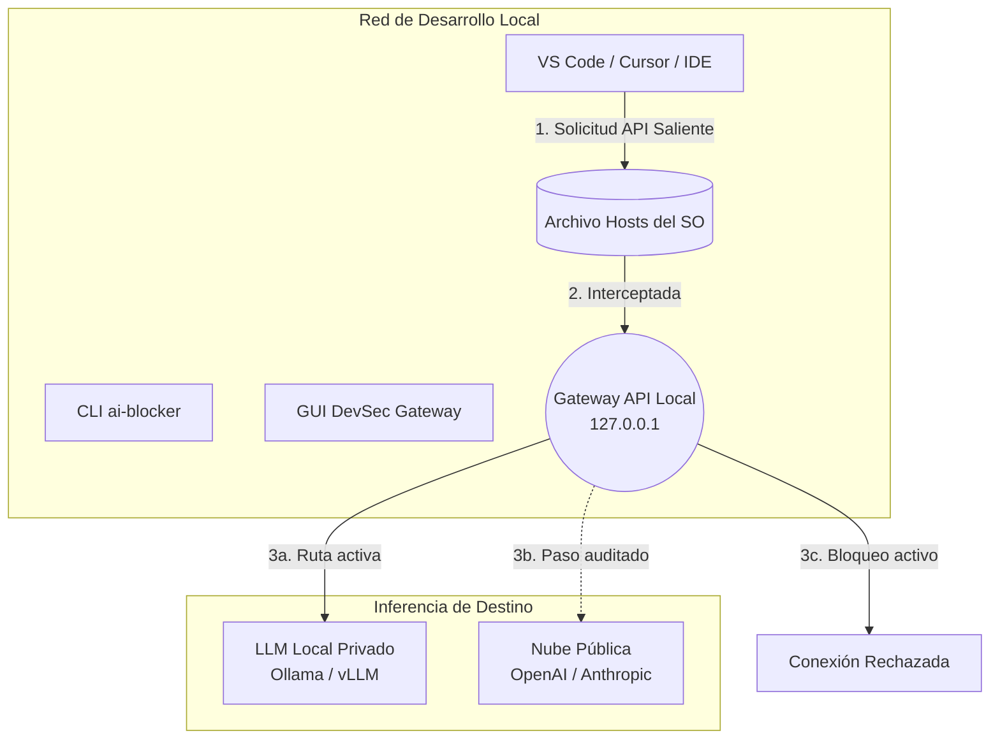

# 🛡️ DevGate

> **Controles locales para bloquear, auditar y enrutar tráfico de IA en entornos de desarrollo.**

<p align="center">
  
</p>

[](https://www.python.org/)
[](#-inicio-rápido)
[](https://github.com/Akunimal/AI-Router-Blocker-AiO/actions/workflows/test.yml)
[](https://github.com/Akunimal/AI-Router-Blocker-AiO/actions/workflows/codeql.yml)
[](https://codecov.io/gh/Akunimal/AI-Router-Blocker-AiO)
[](https://pypi.org/project/devgate/)
[](LICENSE)

[English](README.md) | [Español](README.es.md)

---

## 📖 ¿Qué es esto?

**DevGate** es una herramienta open-source de privacidad y DevSecOps para desarrolladores que adoptan asistentes de código con IA. Ofrece controles locales para bloquear endpoints conocidos de IA, enrutar tráfico API hacia servidores de inferencia locales y auditar procesos activos de editores con IA.

Creado originalmente como una simple interfaz gráfica para bloquear dominios de IA, está evolucionando hacia un **Gateway Zero-Trust** para desarrollo asistido por IA más seguro. La versión actual se centra en bloqueo determinista por archivo `hosts`, router HTTP local, controles CLI seguros por defecto y un auditor de seguridad que mantiene las claves API solo en memoria.

1. **Bloquear:** Una anulación determinista a nivel del sistema operativo mediante el archivo `hosts` que descarta conexiones a más de 38 dominios conocidos de IA.
2. **Enrutar:** Un proxy HTTP local que puede dirigir clientes API compatibles hacia LLMs locales como Ollama, LM Studio o vLLM.
3. **Auditar:** Revisiones de seguridad conscientes de procesos activos para detectar herramientas de IA y señales de riesgo de fuga de datos.

---

## ✨ Características

| Función | Descripción |
|---|---|
| 🔀 **Enrutador API Transparente** | Redirige sin problemas el tráfico HTTP de Copilot/Cursor a tus propios servidores locales de inferencia LLM. |
| 🛡️ **Auditor AI DevSec** | Análisis en vivo de procesos con recomendaciones de OpenAI bajo demanda. Las claves API se mantienen solo en memoria. |
| 💻 **Interfaz CLI Nativa** | Control completo desde la terminal para entornos CI/CD. Usa `ai-blocker --status` o `devgate --block`. |
| 🔒 **Interruptor de Apagado Determinista** | Bloqueo a nivel de sistema operativo mediante entradas administradas en `hosts`. Sin dependencia de servidores remotos de filtrado DNS. |
| 📦 **Distribución Universal** | Instalable vía `pip`, `brew`, `scoop`, o como un único binario ejecutable portable para Windows/Linux/macOS. |
| 🌍 **Interfaz Multilingüe** | Una interfaz gráfica premium (Catppuccin Mocha) con 10 idiomas soportados y elevación inteligente de privilegios del SO (UAC/sudo). |

---

## 🏢 Casos de Uso Empresariales

¿Por qué los equipos DevSecOps despliegan DevGate?

1. **Prevención de Fuga de Datos (PII/Secretos):** Tu equipo usa Cursor o Copilot, pero las normativas (GDPR/HIPAA) prohíben estrictamente que las credenciales o el código propietario salgan a la nube.
2. **Enrutamiento a LLMs "Air-Gapped":** Quieres forzar de manera transparente que todo el tráfico de Copilot en tu red corporativa se dirija a un servidor interno Llama-3 (Ollama), sin que los desarrolladores tengan que tocar la configuración de su IDE.
3. **Auditoría de "Shadow AI":** Descubrir pasivamente qué herramientas de IA no aprobadas o agentes autónomos se están ejecutando en las estaciones de trabajo de los desarrolladores.

Lee nuestra guía completa de **[Casos de Uso Empresariales](docs/use_cases.md)** para más patrones de despliegue.

---

## 🎯 Proveedores Soportados

El motor de intercepción por defecto apunta a **más de 38 dominios** de los principales proveedores:

| Proveedor | Dominios clave interceptados |
|---|---|
| 🟢 **OpenAI** | `api.openai.com`, `chatgpt.com`, `platform.openai.com` |
| 🟠 **Anthropic** | `claude.ai`, `api.anthropic.com`, `anthropic.com` |
| 🐙 **GitHub Copilot** | `copilot.github.com`, `api.githubcopilot.com`, `telemetry.githubcopilot.com` |
| 🔵 **Google AI** | `gemini.google.com`, `aistudio.google.com` |
| 🟦 **Microsoft** | `copilot.microsoft.com`, `bing.com` |
| 🔷 **Meta AI** | `meta.ai`, `ai.meta.com` |
| 🌊 **Mistral / DeepSeek / xAI** | `mistral.ai`, `api.deepseek.com`, `api.x.ai` |

> *La lista de bloqueo es configurable dinámicamente desde [`ai_blocker/constants.py`](ai_blocker/constants.py).*

---

## 🏗️ Arquitectura

DevGate opera en la frontera entre tu entorno de desarrollo local y la nube.



Para sumergirte en profundidad en nuestra estructura modular, los planes de Inspección Profunda de Paquetes (DPI) y los Modelos de Amenazas, lee nuestra **[Documentación de Arquitectura](docs/architecture.md)**.

---

## ✅ Capacidades Actuales vs Roadmap

El proyecto distingue explícitamente qué está implementado hoy y qué sigue como trabajo futuro.

| Área | Estado actual |
|---|---|
| Bloqueo por archivo hosts | Implementado y usado por defecto en GUI/CLI. |
| Gateway API local | Implementado para routing HTTP en loopback hacia servidores LLM locales compatibles. |
| Selección de backend | Implementada en CLI con `hosts` por defecto y soporte experimental `firewall-redirect` en dry-run. |
| Intercepción TLS/DPI | Planificada, no implementada. Las versiones actuales no instalan root CA. |
| Intercepción kernel eBPF/WFP | Trabajo futuro como backend dedicado, no comportamiento activo en runtime. |

El roadmap es ambicioso, pero cada release debe evaluarse por las capacidades implementadas arriba.

---

## 🚀 Inicio Rápido

### 1. Paquete de Python (Pip)
La forma más rápida de empezar a usar la interfaz CLI (terminal).

```bash
pip install devgate

# Los comandos CLI nativos estarán disponibles globalmente:
ai-blocker --status
devgate --block
devgate --unblock
```

### 1.1 Selección de Backend y Dry-Run
Puedes usar `hosts` como backend por defecto, o inspeccionar explícitamente el backend experimental de firewall usando `dry-run` antes de aplicar cambios:

```bash
# Mostrar backends disponibles
ai-blocker --list-backends

# Comportamiento por defecto (backend hosts)
ai-blocker --backend hosts --block work

# Plan del backend experimental (no aplica cambios de red)
ai-blocker --backend firewall-redirect --block work --dry-run
```

### 2. Gestores de Paquetes (macOS y Windows)

**macOS (Homebrew):**
```bash
brew tap Akunimal/devgate https://github.com/Akunimal/AI-Router-Blocker-AiO
brew install devgate
sudo ai-blocker --status
```

**Windows (Scoop):**
```powershell
scoop bucket add devgate https://github.com/Akunimal/AI-Router-Blocker-AiO.git
scoop install devgate
ai-blocker --status
```

### 3. Binarios GUI Portables
Si prefieres una interfaz gráfica enriquecida sin tener que instalar Python:
1. Visita la página de [**Releases**](https://github.com/Akunimal/AI-Router-Blocker-AiO/releases).
2. Descarga el ejecutable correspondiente a tu sistema operativo (`.exe`, binario macOS o Linux AppImage).
3. Ejecuta la aplicación (automáticamente pedirá privilegios de Administrador/sudo al intentar encender el interruptor de red).

---

## 🔒 Modelo de Seguridad

- **Zero-Persistence BYOK:** Las claves de API del auditor semántico se mantienen estrictamente en la memoria RAM. Nunca se guardan en el disco duro, previniendo el robo de credenciales en la cadena de suministro.
- **Modificaciones Quirúrgicas del SO:** El motor utiliza análisis tipo `sed` para inyectar los marcadores `# AI-Block` en el archivo hosts. Garantiza aislamiento total respecto al resto de tus reglas de DNS existentes.
- **Telemetría Aislada:** La aplicación en sí misma tiene absolutamente cero rastreo, análisis de uso o mecanismos ocultos de conexión en segundo plano (phone-home).

---

## 🤝 Código Abierto y Gobernanza

Creemos firmemente que las herramientas de seguridad deben ser 100% transparentes. Este proyecto está construido bajo una gobernanza estricta de código abierto:
- **[Guía de Arquitectura](docs/architecture.md):** Especificaciones técnicas completas.
- **[Guía de Contribución](CONTRIBUTING.md):** Estándares y plantillas de PR.
- **[Código de Conducta](CODE_OF_CONDUCT.md):** Fomentamos una comunidad acogedora.
- **[Política de Seguridad](SECURITY.md):** Reporte responsable de vulnerabilidades.
- **[Licencia](LICENSE):** Licencia MIT.

---

## 🗺️ Roadmap y Visión Futura

Estamos evolucionando activamente hacia ser un **Motor DLP Zero-Trust** corporativo. Nuestros próximos hitos incluyen:
- **Sanitización DLP en Tiempo Real:** Expresiones regulares heurísticas al vuelo para eliminar PII (Información Personal Identificable) antes de enrutar el código.
- **Telemetría de Kernel eBPF:** Detectar fuga de archivos como `.git/config` directamente a nivel del núcleo de Linux.
- **Confidential Computing:** Ejecutar el Gateway de forma blindada dentro de Entornos de Ejecución Confiables (TEEs) como Intel SGX.

Explora nuestro [**ROADMAP.md**](ROADMAP.md) para conocer la visión completa.

---

<p align="center">
  <strong>Audita lo invisible. Enruta lo restringido. No confíes en ningún paquete.</strong><br>
  <em>El Gateway DevSecOps para la era de la IA.</em>
</p>
