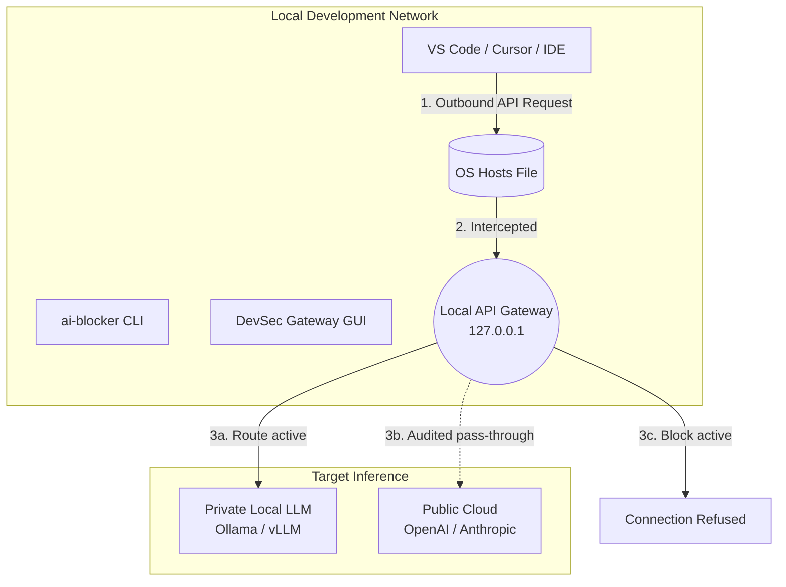

# 🛡️ AI DevSec Gateway (formerly AI Network Blocker)

> **Local controls for blocking, auditing, and routing AI developer traffic.**

<p align="center">
  
</p>

[](https://www.python.org/)
[](#-quick-start)
[](https://github.com/Akunimal/AI-Router-Blocker-AiO/actions/workflows/test.yml)
[](https://github.com/Akunimal/AI-Router-Blocker-AiO/actions/workflows/codeql.yml)
[](https://codecov.io/gh/Akunimal/AI-Router-Blocker-AiO)
[](https://pypi.org/project/ai-devsec-gateway/)
[](LICENSE)

[English](README.md) | [Español](README.es.md)

---

## 📖 What is this?

**AI DevSec Gateway** is an open-source privacy and DevSecOps tool for developers adopting AI coding assistants. It provides local controls to block known AI endpoints, route API traffic to local inference servers, and audit active AI editor processes.

Originally created as a simple GUI to block AI endpoints, it is evolving into a **Zero-Trust Gateway** for safer AI-assisted development. The current release focuses on deterministic hosts-file blocking, a local HTTP router, safe-by-default CLI controls, and a security auditor that keeps API keys in memory only.

1. **Block:** A deterministic OS-level override via the `hosts` file that drops connections to 38+ known AI domains.
2. **Route:** A local HTTP proxy that can route compatible API clients to local LLMs such as Ollama, LM Studio, or vLLM.
3. **Audit:** Process-aware security checks that help identify active AI tools and data-leak risk signals.

---

## ✨ Features

| Feature | Description |
|---|---|
| 🔀 **Transparent API Router** | Seamlessly reroute Copilot/Cursor HTTP traffic to your own Local LLM inference servers. |
| 🛡️ **AI DevSec Auditor** | Live process analysis with on-demand OpenAI recommendations. API keys are memory-only and never persisted. |
| 💻 **Native CLI Interface** | Full headless control for CI/CD environments. Use `ai-blocker --status` or `ai-devsec-gateway --block`. |
| 🔒 **Deterministic Kill Switch** | Hard OS-level blocking through managed `hosts` entries. No reliance on remote DNS filtering servers. |
| 📦 **Universal Distribution** | Install via `pip`, `brew`, `scoop`, or as a portable single-file binary for Windows/Linux/macOS. |
| 🌍 **Multilingual GUI** | A premium Catppuccin Mocha interface with 10 supported languages and smart OS elevation (UAC/sudo). |

---

## 🎯 Supported Providers

The default interception engine targets **38+ domains** across major providers:

| Provider | Key domains intercepted |
|---|---|
| 🟢 **OpenAI** | `api.openai.com`, `chatgpt.com`, `platform.openai.com` |
| 🟠 **Anthropic** | `claude.ai`, `api.anthropic.com`, `anthropic.com` |
| 🐙 **GitHub Copilot** | `copilot.github.com`, `api.githubcopilot.com`, `telemetry.githubcopilot.com` |
| 🔵 **Google AI** | `gemini.google.com`, `aistudio.google.com` |
| 🟦 **Microsoft** | `copilot.microsoft.com`, `bing.com` |
| 🔷 **Meta AI** | `meta.ai`, `ai.meta.com` |
| 🌊 **Mistral / DeepSeek / xAI** | `mistral.ai`, `api.deepseek.com`, `api.x.ai` |

> *The blocklist is dynamically configurable via [`ai_blocker/constants.py`](ai_blocker/constants.py).*

---

## 🏗️ Architecture

AI DevSec Gateway operates at the boundary between your local development environment and the cloud.



For an in-depth dive into our modular structure, Deep Packet Inspection (DPI) plans, and Threat Models, read our **[Architecture Documentation](docs/architecture.md)**.

---

## ✅ Current Capabilities vs Roadmap

This project is intentionally explicit about what is implemented today and what remains future work.

| Area | Current status |
|---|---|
| Hosts-file blocking | Implemented and used by default in GUI/CLI. |
| Local API gateway | Implemented for loopback HTTP routing to compatible local LLM servers. |
| Backend selection | Implemented in CLI with `hosts` default and experimental `firewall-redirect` dry-run support. |
| TLS/DPI interception | Planned, not implemented. No root CA is installed by current releases. |
| eBPF/WFP kernel interception | Planned future backend work, not active runtime behavior. |

The roadmap is ambitious, but releases should be evaluated by the implemented capabilities above.

---

## 🚀 Quick Start

### 1. Python Package (Pip)
The fastest way to get started with the headless CLI.

```bash
pip install ai-devsec-gateway

# Native CLI commands are now available globally:
ai-blocker --status
ai-devsec-gateway --block
ai-devsec-gateway --unblock
```

### 1.1 Backend Selection & Dry-Run
Use hosts as the default backend, or explicitly inspect the experimental firewall backend with dry-run first:

```bash
# Show available backends
ai-blocker --list-backends

# Default behavior (hosts backend)
ai-blocker --backend hosts --block work

# Experimental backend plan only (no network changes applied)
ai-blocker --backend firewall-redirect --block work --dry-run
```

### 2. Package Managers (macOS & Windows)

**macOS (Homebrew):**
```bash
brew tap Akunimal/ai-devsec-gateway https://github.com/Akunimal/AI-Router-Blocker-AiO
brew install ai-devsec-gateway
sudo ai-blocker --status
```

**Windows (Scoop):**
```powershell
scoop bucket add ai-devsec-gateway https://github.com/Akunimal/AI-Router-Blocker-AiO.git
scoop install ai-devsec-gateway
ai-blocker --status
```

### 3. Portable GUI Binaries
If you prefer a rich visual interface without installing Python:
1. Visit the [**Releases**](https://github.com/Akunimal/AI-Router-Blocker-AiO/releases) page.
2. Download the executable for your OS (`.exe`, macOS binary, or Linux AppImage).
3. Run the application (it will automatically request Admin/sudo privileges when toggling the network switch).

---

## 🔒 Security Model

- **Zero-Persistence BYOK:** API keys for the semantic DevSec auditor are strictly kept in-memory. They are never written to disk, preventing supply-chain credential theft.
- **Surgical OS Modifications:** The engine uses targeted `sed`-like parsing to inject `# AI-Block` markers into the OS hosts file. It guarantees absolute isolation from your existing DNS mappings.
- **Isolated Telemetry:** The application itself contains absolutely zero tracking, analytics, or hidden background phone-home mechanics. 

---

## 🤝 Open Source & Governance

We believe that security tools must be 100% transparent. This project is built under strict open-source governance:
- **[Architecture Guide](docs/architecture.md):** Complete technical specifications.
- **[Contributing Guide](CONTRIBUTING.md):** Standards and PR templates.
- **[Code of Conduct](CODE_OF_CONDUCT.md):** We foster a welcoming community.
- **[Security Policy](SECURITY.md):** Responsible vulnerability disclosure.
- **[Codex for OSS Summary](CODEX_FOR_OSS.md):** Maintainer-focused project summary, current scope, and planned Codex usage.
- **[License](LICENSE):** MIT Licensed.

---

## 🗺️ Roadmap & Future Vision

We are actively evolving towards an enterprise **Zero-Trust DLP Engine**. Upcoming milestones include:
- **Real-Time DLP Sanitization:** On-the-fly regex and heuristics to strip PII before routing.
- **eBPF Kernel Telemetry:** Detecting `.git/config` exfiltration directly at the Linux kernel level.
- **Confidential Computing:** Running the Gateway within Trusted Execution Environments (TEEs) like Intel SGX.

Explore our [**ROADMAP.md**](ROADMAP.md) to see the full vision.

---

<p align="center">
  <strong>Audit the unseen. Route the restricted. Trust no packets.</strong><br>
  <em>The DevSecOps Gateway for the AI era.</em>
</p>
