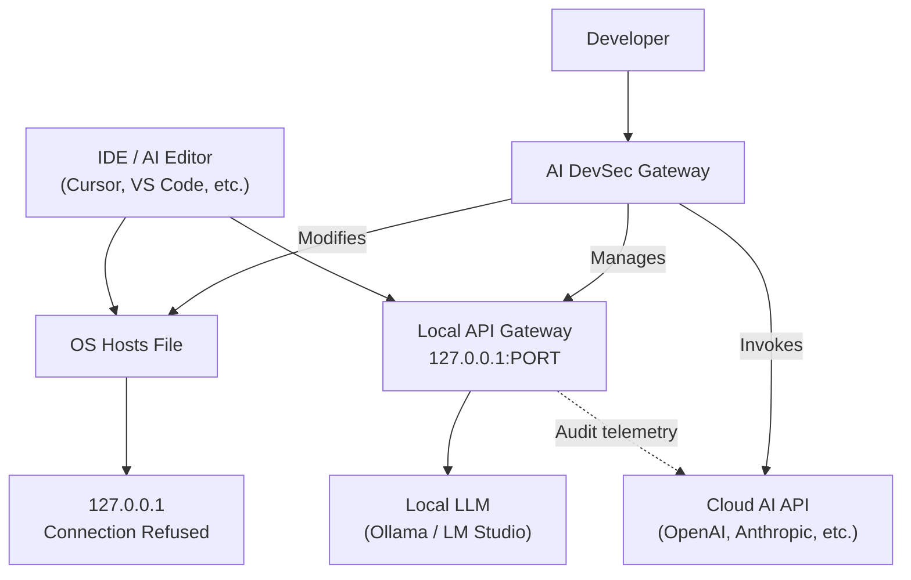
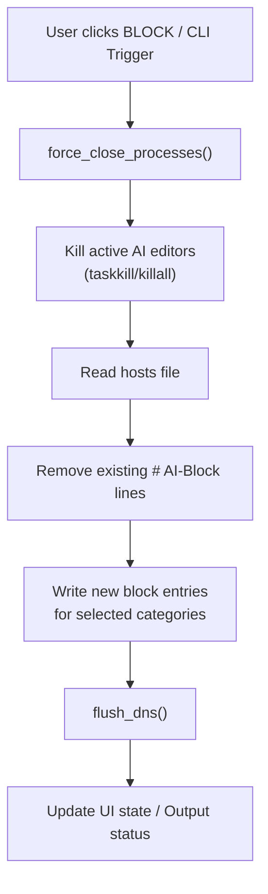

# Architecture & Internal Flow

This document details the high-level architecture, design decisions, and internals of AI DevSec Gateway.

---

## System Overview

AI DevSec Gateway integrates three distinct engines under a unified user interface:

```
┌─────────────────────────────────────────────────────┐
│                  AI DevSec Gateway                  │
│                                                     │
│  ┌──────────────┐  ┌──────────┐  ┌──────────────┐  │
│  │ Hosts Engine │  │ API      │  │ DevSec       │  │
│  │ (DNS Override│  │ Gateway  │  │ Auditor      │  │
│  │  & Kill      │  │ (Proxy)  │  │ (LLM-powered)│  │
│  │  Switch)     │  │          │  │              │  │
│  └──────────────┘  └──────────┘  └──────────────┘  │
│                                                     │
│  ┌──────────────────────────────────────────────┐   │
│  │                 GUI & CLI Interfaces         │   │
│  └──────────────────────────────────────────────┘   │
└─────────────────────────────────────────────────────┘
```

---

## Context Diagram (C4 Level 1)



---

## Module Breakdown

With the v1.2.1 package refactoring, logic is isolated into clean Python modules:

### 1. Network Backends (`network_backends.py`)
Defines the internal enforcement contract used by blocking workflows:
`activate(domains)`, `deactivate()`, and `status()`.

The production default is `HostsBackend`, which preserves the current hosts-file behavior. `FirewallRedirectBackend` is a non-kernel foundation that builds OS command plans through an injectable runner, making firewall/redirect behavior testable without changing machine network rules during unit tests.

Linux eBPF and Windows Filtering Platform (WFP) are future backend implementations behind this interface, not current runtime dependencies.

### 2. Hosts Engine (`block_actions.py` & `system_utils.py`)
Responsible for reading the OS hosts file (`/etc/hosts` or `System32\drivers\etc\hosts`), removing any previous configurations containing the `# AI-Block` tag, and writing fresh rules mapping blocked domains to `127.0.0.1`.
After editing, it calls system executables (`ipconfig /flushdns`, `resolvectl`, `dscacheutil`) to silently flush the system DNS cache.

### 3. Local Proxy Gateway (`gateway.py`)
Uses standard library HTTP handlers (`BaseHTTPRequestHandler`) to spin up a threaded proxy server. It captures outbound requests (GET, POST, PUT, PATCH, DELETE, OPTIONS) and forwards them to a configured URL (e.g. `http://localhost:11434` for Ollama).
*   **SSE Streaming Support:** Features streaming response redirection in 1KB chunks to preserve Server-Sent Events (SSE) for real-time editor completion lists.
*   **Request Body Preservation:** For mutating methods, request bodies are forwarded whenever `Content-Length` is present, including DELETE requests from REST clients.
*   **Zero-Dependency:** Uses `urllib.request` exclusively, avoiding dependency bloat.
*   **TLS Status:** The current gateway does not terminate TLS or perform DPI. Root CA generation, trust-store installation, and surgical HTTPS endpoint filtering remain planned Phase 2 work.

### 4. Active Process Monitor (`block_actions.py`)
Uses subprocess pipelines (`tasklist` on Windows, `ps -A` on Unix) to scan running system processes every 3 seconds, alerting users if blocked applications (like Cursor, Windsurf, or Copilot node processes) are active.

---

## Core Execution Flow


